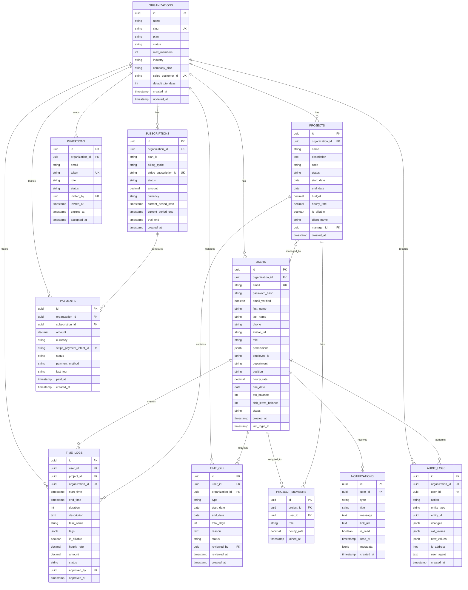

# 📊 Entity-Relationship Diagram

## Visual ER Diagram (Mermaid Format)



---

## Relationship Details

### One-to-Many Relationships

#### **ORGANIZATIONS → USERS**
- One organization has many users
- Each user belongs to one organization
- Cascade delete: If organization is deleted, all users are deleted

#### **ORGANIZATIONS → PROJECTS**
- One organization has many projects
- Each project belongs to one organization
- Cascade delete: If organization is deleted, all projects are deleted

#### **ORGANIZATIONS → SUBSCRIPTIONS**
- One organization has many subscriptions (history)
- One active subscription at a time
- Set null on delete: If organization is deleted, subscriptions remain for billing history

#### **USERS → TIME_LOGS**
- One user creates many time logs
- Each time log belongs to one user
- Cascade delete: If user is deleted, their time logs are deleted

#### **PROJECTS → TIME_LOGS**
- One project contains many time logs
- Each time log is for one project
- Cascade delete: If project is deleted, all time logs are deleted

---

### Many-to-Many Relationships

#### **USERS ↔ PROJECTS (via PROJECT_MEMBERS)**
- Users can be assigned to multiple projects
- Projects can have multiple users
- Junction table: `project_members`
- Additional data: role, hourly_rate, joined_at

---

### Self-Referencing Relationships

#### **USERS → PROJECTS (as manager)**
- A user (manager) can manage multiple projects
- A project has one manager
- Optional relationship (manager can be null)

#### **USERS → TIME_OFF (as reviewer)**
- A user (admin) can review multiple time off requests
- A time off request is reviewed by one admin

---

## Database Constraints

### Primary Keys
- All tables use UUID primary keys
- Generated using `uuid_generate_v4()`

### Foreign Keys
- All foreign keys enforce referential integrity
- Cascade deletes for dependent data
- Set null for historical references

### Unique Constraints
1. `organizations.slug` - Unique organization URL
2. `organizations.stripe_customer_id` - One Stripe customer per org
3. `users.email` - Unique email addresses
4. `subscriptions.stripe_subscription_id` - Unique Stripe subscription
5. `invitations.token` - Unique invitation tokens
6. `payments.stripe_payment_intent_id` - Unique payment intents
7. `project_members(project_id, user_id)` - User can't be added to project twice

### Check Constraints
1. `users.role` - Must be 'super_admin', 'admin', or 'employee'
2. `users.status` - Must be 'active', 'inactive', 'suspended', or 'invited'
3. `users.email` - Must match email regex pattern
4. `organizations.plan` - Must be 'starter', 'professional', or 'enterprise'
5. `organizations.status` - Must be 'active', 'suspended', 'cancelled', or 'trial'
6. `time_logs.status` - Must be 'running', 'stopped', 'approved', or 'rejected'
7. `time_off.type` - Must be 'vacation', 'sick', 'personal', 'unpaid', or 'holiday'
8. `time_off.status` - Must be 'pending', 'approved', 'rejected', or 'cancelled'

---

## Indexes for Performance

### Organizations
- `idx_org_slug` - Fast lookup by slug
- `idx_org_stripe` - Fast lookup by Stripe customer ID
- `idx_org_status` - Filter by status

### Users
- `idx_user_email` - Fast login lookup
- `idx_user_org` - List users by organization
- `idx_user_role` - Filter by role
- `idx_user_status` - Filter by status

### Projects
- `idx_project_org` - List projects by organization
- `idx_project_status` - Filter by status
- `idx_project_manager` - Find projects by manager

### Time Logs
- `idx_timelog_user` - User's time logs
- `idx_timelog_project` - Project time logs
- `idx_timelog_org` - Organization time logs
- `idx_timelog_date` - Filter by date range
- `idx_timelog_status` - Filter by status
- `idx_timelog_start` - Order by start time

### Subscriptions
- `idx_sub_org` - Organization subscription
- `idx_sub_stripe` - Stripe integration
- `idx_sub_status` - Filter by status

### Audit Logs
- `idx_audit_org` - Organization audit logs
- `idx_audit_user` - User action history
- `idx_audit_entity` - Entity change history
- `idx_audit_action` - Filter by action type
- `idx_audit_created` - Time-based queries

---

## Data Flow Diagrams

### 1. Signup Flow

```
┌──────────────┐
│  Frontend    │
│  /signup     │
└──────┬───────┘
       │ 1. Complete form
       │    (account + org + plan)
       ▼
┌──────────────────┐
│  POST /api/auth/ │
│  create-checkout │
└──────┬───────────┘
       │ 2. Create Stripe
       │    checkout session
       ▼
┌──────────────┐
│   Stripe     │
│  Checkout    │
└──────┬───────┘
       │ 3. Payment success
       │    webhook
       ▼
┌─────────────────────┐
│ Webhook Handler     │
│ Creates:            │
│ - Organization      │
│ - User (admin)      │
│ - Subscription      │
│ - Payment record    │
└──────┬──────────────┘
       │ 4. Send welcome email
       ▼
┌──────────────┐
│  Redirect to │
│    /login    │
└──────────────┘
```

---

### 2. Time Tracking Flow

```
┌──────────────┐
│  Employee    │
│  Dashboard   │
└──────┬───────┘
       │ 1. Start timer
       ▼
┌─────────────────────┐
│ POST /api/time-logs │
│ {                   │
│   projectId,        │
│   startTime,        │
│   status: 'running' │
│ }                   │
└──────┬──────────────┘
       │ 2. Work...
       ▼
┌──────────────────────┐
│ POST /api/time-logs/ │
│      :id/stop        │
│ {                    │
│   endTime            │
│ }                    │
└──────┬───────────────┘
       │ 3. Calculate duration
       │    & amount
       ▼
┌─────────────────────┐
│ Admin reviews       │
│ POST /api/time-logs/│
│      :id/approve    │
└──────┬──────────────┘
       │ 4. Update payroll
       ▼
┌──────────────┐
│  Reports     │
└──────────────┘
```

---

### 3. Subscription Management Flow

```
┌──────────────┐
│  Admin       │
│  Settings    │
└──────┬───────┘
       │ 1. Upgrade plan
       ▼
┌──────────────────────┐
│ POST /api/           │
│ subscriptions/       │
│ :id/upgrade          │
└──────┬───────────────┘
       │ 2. Update Stripe
       │    subscription
       ▼
┌──────────────┐
│   Stripe     │
│   Update     │
└──────┬───────┘
       │ 3. Webhook:
       │    subscription.updated
       ▼
┌─────────────────────┐
│ Update:             │
│ - Subscription      │
│ - Organization plan │
│ - max_members       │
└──────┬──────────────┘
       │ 4. Notify admin
       ▼
┌──────────────┐
│  Email       │
│  Notification│
└──────────────┘
```

---

## Query Examples

### Get User with Organization
```sql
SELECT 
    u.*,
    o.name as org_name,
    o.plan as org_plan,
    o.status as org_status
FROM users u
JOIN organizations o ON u.organization_id = o.id
WHERE u.email = 'user@example.com'
    AND u.status = 'active';
```

### Get Time Logs for Date Range
```sql
SELECT 
    tl.*,
    u.first_name,
    u.last_name,
    p.name as project_name
FROM time_logs tl
JOIN users u ON tl.user_id = u.id
JOIN projects p ON tl.project_id = p.id
WHERE tl.organization_id = 'org-uuid'
    AND tl.start_time >= '2024-01-01'
    AND tl.start_time < '2024-02-01'
ORDER BY tl.start_time DESC;
```

### Get Organization Summary
```sql
SELECT 
    o.*,
    COUNT(DISTINCT u.id) as total_users,
    COUNT(DISTINCT p.id) as total_projects,
    SUM(tl.duration) / 3600 as total_hours_logged,
    s.plan_id,
    s.status as subscription_status
FROM organizations o
LEFT JOIN users u ON o.id = u.organization_id AND u.status = 'active'
LEFT JOIN projects p ON o.id = p.organization_id
LEFT JOIN time_logs tl ON o.id = tl.organization_id
LEFT JOIN subscriptions s ON o.id = s.organization_id 
    AND s.status = 'active'
WHERE o.id = 'org-uuid'
GROUP BY o.id, s.plan_id, s.status;
```

### Get Project Budget Status
```sql
SELECT 
    p.id,
    p.name,
    p.budget,
    COALESCE(SUM(tl.amount), 0) as spent,
    p.budget - COALESCE(SUM(tl.amount), 0) as remaining,
    COUNT(DISTINCT pm.user_id) as team_size
FROM projects p
LEFT JOIN time_logs tl ON p.id = tl.project_id
LEFT JOIN project_members pm ON p.id = pm.project_id
WHERE p.organization_id = 'org-uuid'
    AND p.status = 'active'
GROUP BY p.id, p.name, p.budget;
```

### Get User PTO Balance
```sql
SELECT 
    u.id,
    u.first_name,
    u.last_name,
    u.pto_balance,
    o.default_pto_days,
    COUNT(to.id) FILTER (WHERE to.status = 'approved') as approved_requests,
    SUM(to.total_days) FILTER (WHERE to.status = 'approved') as days_used,
    u.pto_balance - COALESCE(SUM(to.total_days) FILTER (WHERE to.status = 'approved'), 0) as days_remaining
FROM users u
JOIN organizations o ON u.organization_id = o.id
LEFT JOIN time_off to ON u.id = to.user_id
WHERE u.id = 'user-uuid'
GROUP BY u.id, u.first_name, u.last_name, u.pto_balance, o.default_pto_days;
```

---

## Table Statistics

| Table | Estimated Rows/Org | Growth Rate | Storage Est. |
|-------|-------------------|-------------|--------------|
| organizations | 1 | Constant | ~5 KB |
| users | 10-50 | Low | ~50 KB |
| projects | 5-20 | Medium | ~20 KB |
| project_members | 20-100 | Medium | ~10 KB |
| time_logs | 5000-50000 | High | ~5 MB |
| time_off | 50-500 | Low | ~50 KB |
| subscriptions | 1-10 | Very Low | ~5 KB |
| payments | 12-365 | Low | ~100 KB |
| audit_logs | 1000-10000 | High | ~1 MB |
| notifications | 100-1000 | Medium | ~100 KB |
| invitations | 10-100 | Low | ~10 KB |

**Total estimated storage per organization per year:** ~6-10 MB

---

## Backup & Maintenance

### Daily Backups
- Full database backup
- Backup retention: 30 days
- Point-in-time recovery enabled

### Weekly Maintenance
- VACUUM ANALYZE on all tables
- Rebuild indexes
- Check for slow queries

### Monthly Tasks
- Archive old audit logs (>6 months)
- Delete expired invitations
- Clean up rejected time logs (>1 year)

---

**Status:** ✅ Complete  
**Database Type:** PostgreSQL 14+  
**Schema Version:** 1.0
